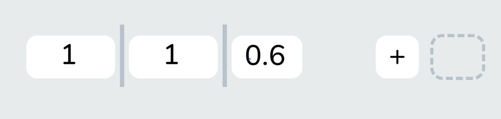
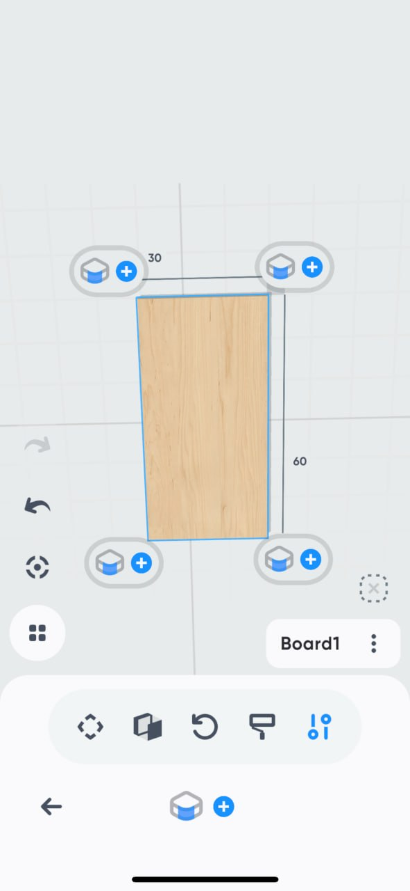
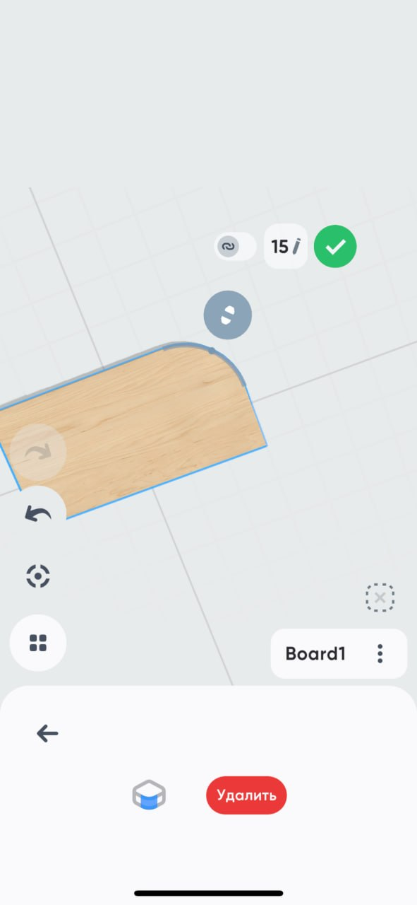
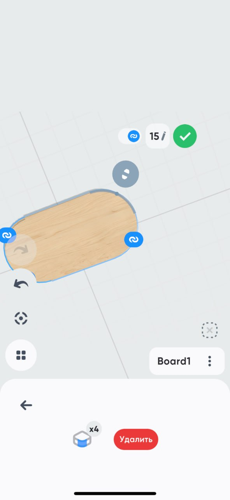
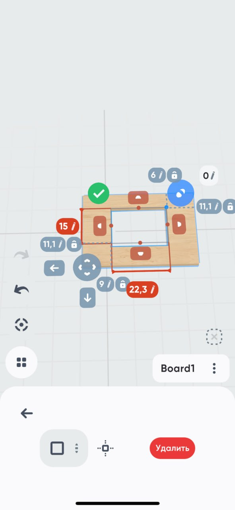
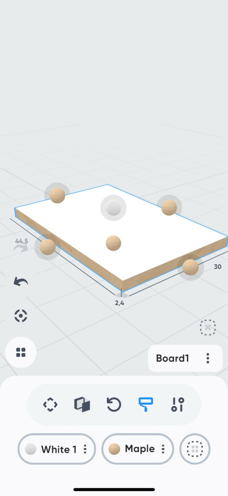

# Founder UI Fixtures (behavior-normative)

The founder's 7 interaction fixtures referenced by `CONSTRUCTION_FRAME_v4.md` §12 and
`HANDOVER_04_SAIDISLOM.md` (Steps 3, 4, 4b, 6). v4 originally pointed at `UI Examples liked/TAs/`
(gitignored, absent from the repo); the images are re-homed here so they ship with a clone.

**Law (v4 §12):** the *behavior* in each fixture must be achieved; the *visual styling* is free
("as is, not 1-to-1"). Open the relevant fixture before building its step.

| Image | Fixture (v4 §12 name) | Spec § | Step | Gate | What it fixes as law |
|---|---|---|---|---|---|
| `03-info-card.jpg` | `info.png` | §5 | **3** | G3 | Info card: a **multi-segment vertical material color bar** before the name, the name, and a «⋯» menu. |
| `04-shelf-ratios.jpg` | `shelf adding ratios.png` | §4 | **4** | G4 | The **ratio pill-row editor**: value pills (`1 \| 1 \| 0.6`) + divider bars + `+` pill + dashed new-zone slot. |
| `04b-round-00-corner-chips.jpg` | `making round 00.png` | §12.1 | **4b** | G4b | Corner ops **enter via `+` chips on each of the 4 corners** of a selected part. |
| `04b-round-01-radius-edit.jpg` | `making round 01.png` | §12.1 | **4b** | G4b | Radius editing: **numeric pill (✎) + drag handle + live preview + green confirm**; op is deletable. |
| `04b-round-03-linked-4-corners.jpg` | `making round 03 binded 4 corners.png` | §12.1 | **4b** | G4b | **Chain toggle binds all 4 corners** to one radius (×4 badge); unlink → per-corner values. |
| `04b-cutout.jpg` | `cutting and making hole … santimeters.png` | §12.2–12.3 | **4b** | G4b | **Cutout op**: editable size pills + **lockable 🔒 offset pills** to each edge + drag tabs + center-snap + **units toggle (cm/mm)**. |
| `06-kromka-mode.jpg` | `kromka mode.png` | §8.1 | **6** | G6 | Kromka **paint metaphor**: K-variable pills at the bottom (e.g. White 1 / Maple) + tappable **balls on each edge** of the part. |

## The fixtures

### Step 3 · Info card

### Step 4 · Ratio pill-row editor

### Step 4b · Corner rounding — entry (+ chips on 4 corners)

### Step 4b · Corner rounding — radius edit

### Step 4b · Corner rounding — linked ×4 corners

### Step 4b · Cutout (with lockable offsets + cm/mm)

### Step 6 · Kromka (Jiyak) mode — paint metaphor

